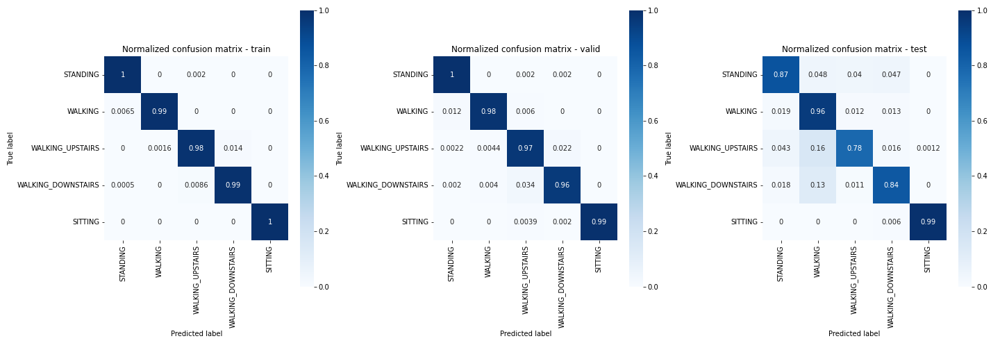

# LSTM for Human Activity Recognition classification

Insperied by the [LSTMs for Human Activity Recognition](https://github.com/guillaume-chevalier/LSTM-Human-Activity-Recognition) and [Deep Learning (and Machine Learning) for Human Activity Recognition](https://github.com/takumiw/Deep-Learning-for-Human-Activity-Recognition) repository.

Human Activity Recognition (HAR) using smartphones dataset and an LSTM. Classifying the type of movement amongst five categories:

    WALKING
    WALKING_UPSTAIRS
    WALKING_DOWNSTAIRS
    SITTING
    STANDING
    
## Details about the input data

> The sensor signals (accelerometer and gyroscope) were pre-processed by applying noise filters and then sampled in fixed-width sliding windows of 2.56 sec and 50% overlap (128 readings/window). The sensor acceleration signal, which has gravitational and body motion components, was separated using a Butterworth low-pass filter into body acceleration and gravity. The gravitational force is assumed to have only low frequency components, therefore a filter with 0.3 Hz cutoff frequency was used.

## How to run it
Skip this step if you want to use the existing data!
The file `handel_data.ipynb` is used to transform the HyperIMU CSV data to raw data with labels (first two boxes). Under comes the creation of the train and testing data. 

Next open the file `LSTM.ipynb`. Run every box. Last one is starting to run the LSTM network. Output of actions will be written under the box and in the folder `logs` will `.h5` files of the data, loss and accuracy plots, and comfusion matrix.

## Results

